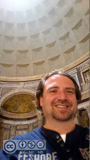

 Caesar Cipher
=============

Caesar Cipher / Shift Cipher encryption technique based tool.

<em>Start a session in browser on http://omerkel.github.io/caesar_cipher/html5/src </em>

The basic concept of the Caesar Cipher is one of the encryption techniques
that should have been used by Gaius Iulius Caesar (*July 100BC; &dagger;March
15th, 44BC) to protect message exchange among his military troops.

Caesar Cipher encryption is basically performed by monoalphabetic character
substitution applying a positional shift in a given alphabet. Reversing
the shift by same amount of positions with same alphabet decrypts the
ciphered text into plain text again. Such that the secret key in this
symmetric cipher is represented by the number respresenting the amount
of positions to shift and the usage of the correct alphabet to be applied.

### Contributors / Authors

<table>
  <tr>
    <td>
Oliver Merkel, the oculus of the Pantheon's
      dome in Rome, Italy,  This image is licensed under a <a rel="license" href="http://creativecommons.org/licenses/by-nc-nd/4.0/">Creative Commons Attribution-NonCommercial-NoDerivatives 4.0 International License</a>.    
    

    </td>
    <td width="50%"></td>
  </tr>
</table>

_All logos, brands, and trademarks mentioned belong to their respective owners._
