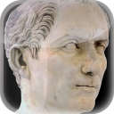

These images are based on a public domain photograph taken from a bust of
[Gaius Iulius Caesar](https://commons.wikimedia.org/wiki/File:Bust_of_Gaius_Iulius_Caesar_in_Naples.jpg)
by A. Wahra in 1997. The photographer provided the works as public domain
or in case this is not legally possible granting anyone the right to use
this work for any purpose, without any conditions, unless such
conditions are required by law.

The original bust can be found in the
[Museo Archeologico Nazionale di Napoli, Piazza Museo Nazionale, 19, 80135 - Napoli, Italy](http://cir.campania.beniculturali.it/museoarcheologiconazionale).

The icons you can find in this repository are derived images from A. Wahra's work.
These icons are created by [Oliver Merkel](../../../AUTHORS). The icons are licensed under

  Creative Commons License: Images are licensed under a

   <a rel="license" href="http://creativecommons.org/licenses/by-nc-sa/4.0/">Creative Commons Attribution-NonCommercial-ShareAlike 4.0 International License</a>.

* http://creativecommons.org/licenses/by-nc-sa/4.0
